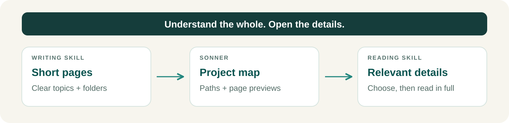

<p align="center">
  
</p>

<h1 align="center">Atomic Documentation</h1>

<div align="center">

[](https://github.com/game-dev-rta-club/atomic-documantation/actions/workflows/ci.yml)
[](https://github.com/game-dev-rta-club/atomic-documantation/releases/latest)
[](LICENSE)

</div>

**Write docs people understand. Give agents a map to find them.**

Two skills for Codex, Claude Code and other [Agent Skills](https://agentskills.io)-compatible agents: clear documentation and a project overview that points to the right details.

## Write for a new teammate

The [writing skill](skills/atomic-doc-writing/SKILL.md) keeps each topic in a short page, organized into meaningful folders. Explain it to a 20-year-old new employee: plain language, concrete examples and one clear home for each explanation.



## Find the right page before reading

The [reading skill](skills/atomic-doc-reading/SKILL.md) uses **Sonner** to see the folder tree and page previews, then opens the relevant pages in full.

```text
Files:
  Docs/
    Delivery/
      retry.md keyPoints="Retries three times, then records a failed job."
    Accounts/
      deletion.md keyPoints="Access ends immediately; records expire after 30 days."
```

Existing Markdown works as-is. Add a short English `keyPoints` preview to important pages to show their meaning beside the file path.

<details>
<summary>Add page previews or code metadata</summary>

```markdown
---
keyPoints: >-
  Delivery retries three times, then records a failed job for manual retry.
---
```

For code and assets, use [project metadata extensions](skills/atomic-doc-reading/references/extensions.md).

</details>

## Install and use

From your project, install both skills for Codex and Claude Code:

```sh
npx skills@latest add game-dev-rta-club/atomic-documantation \
  --skill atomic-doc-writing \
  --skill atomic-doc-reading \
  --agent codex \
  --agent claude-code \
  --yes
```

```text
$atomic-doc-reading Understand this project before changing its delivery system.
$atomic-doc-writing Organize the delivery docs so a new teammate can use them.
```

In Claude Code, use `/atomic-doc-reading` and `/atomic-doc-writing` instead. Refresh your agent's skill list after installation.

**Requires:** Node.js 24+, npm and Git on macOS, Windows or Linux. Installation is project-local. Sonner is acquired automatically on first use, with no global command or project dependency setup. Cached runs work offline.

<details>
<summary>Choose another agent or just one skill</summary>

```sh
npx skills@latest add game-dev-rta-club/atomic-documantation
```

Choose the skills and target agents. Each skill works on its own.

</details>

## Update

Rerun the install command when you want a newer release. Each skill uses its exact, integrity-checked Sonner version; there are no automatic updates. See the [release notes](CHANGELOG.md).

## Project

[Game Dev RTA Club](https://github.com/game-dev-rta-club) · [MIT](LICENSE) · [Contributing](CONTRIBUTING.md) · [Code of Conduct](CODE_OF_CONDUCT.md) · [Security](SECURITY.md) · [Attribution](THIRD_PARTY_NOTICES.md)
